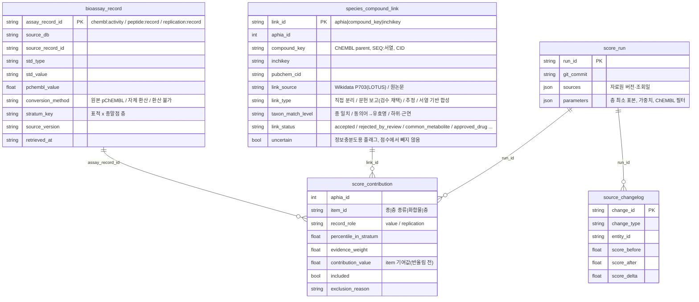

# MBPI 점수 계보 (종 → 화합물 → 시험 → 점수)와 자료원 변경 기록

`scripts/lineage.py`는 **기록 계층**이다. 발행된 `dist/assessments.json`과 `build_verified_indices.py`가 읽는 같은 입력을 읽고, 점수를 새로 계산하거나 바꾸지 않는다. 빌드에는 `chembl_items(..., trail=)` 선택 인자 하나만 더했다. 이 인자는 기록용이며, 기본값(`None`)일 때 출력은 바이트 단위로 같다(`--check` 통과).

## 실행

```sh
export PYTHONUTF8=1
python scripts/lineage.py export                 # research/lineage/<run_id>/ 네 테이블
python scripts/lineage.py explain --aphia 494972 # 한 종의 MBPI 근거 트리 (--json: 원행)
python scripts/lineage.py diff --from verified-pilot-3.27 --to verified-pilot-3.28   # reports/source_changes_<to>.md
python scripts/lineage.py changelog              # research/lineage/source_changelog.json (git 이력 전체)
python scripts/lineage.py validate               # reports/lineage_validation_<run_id>.md, 실패 시 종료 코드 1
python -m unittest verification.test_lineage
```

- `run_id`는 `method_version`(예: `verified-pilot-3.28`)이다. `diff`는 method_version 대신 git revision도 받는다. 같은 버전의 커밋이 여러 개면 가장 최근 커밋을 쓴다.
- **새 버전을 발행할 때**는 `build_verified_indices.py`를 실행한 뒤 `lineage.py export`와 `lineage.py changelog`를 실행해 함께 커밋한다. 그러지 않으면 `test_lineage`가 실패한다. 테이블이 낡았거나, changelog의 마지막 실행이 현재 실행과 다르기 때문이다.
- `changelog`와 `diff`는 git 이력이 필요하다. CI(얕은 checkout)는 커밋된 `source_changelog.json`만 검사한다.

## 테이블 구조



- **재계산 규칙**: 종 MBPI = `round1(max(contribution_value))`이고, 대상은 `included=true`, `record_role=value`인 행이다. 한 항목(item)에 기록이 여러 건이면 같은 기여값이 기록마다 반복된다. 항목 값은 그 기록들의 p값 중앙값이다. 발행 MBPI와 같은지 검사 1이 확인한다.
- **제외 기록**은 지우지 않고 `included=false`로 남기며 사유를 함께 적는다. 사유 종류:
  - 연결 기각(`rejected_by_review`)
  - 공통 대사산물(`common_metabolite`)
  - 승인 의약품(`approved_drug`)
  - 층 밖 표적
  - 비교집단 최소 수 미달
  - 같은 층 분류에서 더 높은 표적이 채택됨(`not_best_target_in_stratum_class`)
  - ChEMBL 기탁자 의견(`activity_comment`)
  - 원논문 행의 보류 사유
- ChEMBL 스냅샷은 pChEMBL만 저장하므로 `std_value`와 `std_units`는 비어 있다. assay type·중복 필터에 걸린 행은 건수만 남아 있어 기록 행이 없다(`score_run.json`에 명시).

## 자료원 우선순위 (현재 코드 그대로)

| 층 | 종 → 물질 연결 | 활성값 | 비교집단 |
| --- | --- | --- | --- |
| ChEMBL (`chembl`) | Wikidata P703(LOTUS) 중 DOI 참고문헌이 있는 진술, 또는 원논문 검증 연결(CMNPD·Europe PMC 검색) + 연결 검수 | ChEMBL 37 pChEMBL (`=`, B/F, 유효성 의견 없음) | 같은 표적 × standard_type 전체 ChEMBL 활성 (최소 30) |
| ACE 펩타이드 (`peptide`) | 원논문(서열 확정) | 원논문 IC50 µM → 6 − log10 | AHTPDB 고정 코호트 |
| 항균 (`amp`) / 항암 (`anticancer`) | 원논문 | 원논문 MIC / 세포 IC50 | DBAASP / CancerPPD 고정 코호트 |

- 한 층은 자료원 하나만 쓴다. 그래서 CMNPD → ChEMBL → PubChem 순서의 **대체(fallback)** 와 여러 DB 간 **중복 해소(dedup)** 는 현재 일어나지 않는다. 변경 유형은 정의해 두었지만 0건이다.
- PubChem은 InChIKey → CID 식별자 확인에만 쓴다. PubChem BioAssay 활성값은 쓰지 않는다.
- 같은 DOI는 여러 DB에 있어도 논문 한 편으로 센다. 재현 측정(`replication`)은 근거 가중에만 쓰고 값에는 쓰지 않는다.

## 자료원 변경 유형 (`source_changelog.json`)

`changelog`는 연속한 두 발행 실행의 항목(종 × 화합물 × 층)을 비교해 아래 유형으로 분류한다.

| 유형 | 판정 |
| --- | --- |
| `fallback`, `dedup` | 대체·중복 해소. 현재 구조에서는 생기지 않음 |
| `identifier` | 같은 항목의 InChIKey, CID 또는 ChEMBL parent가 바뀜 |
| `version` | 자료원 릴리스 변경(ChEMBL_xx), 비교집단 크기 변경으로 백분위가 바뀜, 또는 `sources`의 version이 바뀜 |
| `conversion` | 같은 기록에서 환산값이나 단위 변환이 바뀜 |
| `evidence` | 시험 기록이 추가·제거되거나 독립 논문 수(근거 가중)가 바뀜, 항목·종이 추가됨 |
| `method` | 기록·값·비교집단이 같은데 기여값이 바뀜(계수 등 규칙 변경) |
| `unexplained` | 점수는 바뀌었는데 항목 변경이 없음. **검사 5는 0건이어야 통과** |

각 실행 쌍에는 그 config의 `changes_from` 설명을 `method_note`로 붙인다. 사람이 읽는 요약은 `diff`가 만든다. 예: "톳 MBPI 65.0→86.6: 근거 기록 변경 — GKY 근거 가중 0.75 → 1.0 (독립 논문 1 → 2)".

## 검증 (`verification/test_lineage.py`)

1. 재현성: 포함된 기여 행으로 다시 계산한 MBPI가 발행 MBPI와 같음(30종)
2. 참조 무결성: 기여 행 → 시험 기록, 포함 행 → 종–화합물 연결. 고아 행 0건
3. 출처 필수: `source_db`, `source_record_id`, `retrieved_at`에 빈 값 0건
4. 층 일관성: 백분위가 0–100이고 층 안 순위가 p값 순서와 같음
5. 변경 기록 완전성: `unexplained` 0건이고 changelog가 현재 실행까지 있음
6. 사후 검증 사례: ziconotide·trabectedin·eribulin 기원종이 실행에 있으면 explain이 원자료 링크까지 이어지는지 확인. 현재 이 종들은 `posthoc-3.27` 별도 스냅샷에서만 점수화되므로 skip하고 사유를 남긴다.

그 밖에 `changelog` 분류기를 합성 fixture로 검사하고, 커밋된 CSV가 현재 입력과 같은지도 확인한다.

## 이번 계보 작업에서 보인 점 (로직은 고치지 않음)

- ChEMBL 층에서 한 화합물은 층 분류(단백질·병원체·세포)마다 **가장 높은 표적 하나**만 남는다. 버려진 표적은 이제 `not_best_target_in_stratum_class`로 기록된다. 같은 화합물의 다른 표적 값은 점수에 쓰이지 않으므로, 최고값 선택에 따른 편향은 민감도로 따로 보고해야 한다.
- 연결 유형(공생미생물 유래 여부)은 원자료에 구조화된 필드가 없어 `link_type`이 그것을 구분하지 못한다. okadaic acid(와편모조류 생산)와 halocynthiaxanthin(먹이에서 유래했을 가능성이 있는 카로티노이드로, 참굴·홍합 연결에 쓰임)은 설명 문장(caveat)과 연결 검수에만 남아 있다. 공생·먹이 기원을 연결 검수의 구조화된 필드로 추가하는 방안을 검토할 필요가 있다.
- 항암 층은 비교집단에서 자기 자신을 뺀 백분위를 쓴다. 그래서 같은 값이라도 항목마다 순위가 조금 다를 수 있다(현재 실행에서는 불일치 0건).
